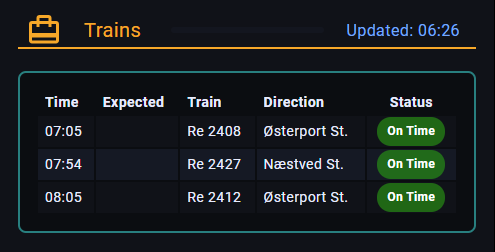

# hass-rejseplanen

Home Assistant add-on repository with one add-on: **Rejseplanen Fetcher**.

The add-on fetches departures from Rejseplanen, filters by regional train category (`catOut=Re`), compacts the data for dashboards, wraps it in a status payload, and publishes it to MQTT on a configurable interval (minimum 1 minute).

## Prerequisites

This integration requires a running MQTT broker.

For Home Assistant, use the official Mosquitto broker add-on:
- https://github.com/home-assistant/addons/tree/master/mosquitto

## Repository structure

```text
hass-rejseplanen/
├── repository.yaml
└── rejseplanen/
    ├── config.yaml
    ├── Dockerfile
    ├── find_location_id.py
    ├── run.sh
    └── app.py
```

## What it runs

On each poll interval, the add-on runs:

```bash
python3 /app/app.py 8600626 --cat-out Re --compact-data --mqtt-on
```

## Find station IDs

Use `rejseplanen/find_location_id.py` to look up station/stop IDs for `rejseplanen_stop_id`.

Example:

```bash
python3 rejseplanen/find_location_id.py "København H" --access-id "<your_access_id>"
```

The script returns JSON with normalized matches and includes `id`/`extId` fields you can use in add-on config.

Access ID resolution order:
- `--access-id`
- `REJSEPLANEN_ACCESS_ID` environment variable
- `$env` or `.env` file in the current directory

## MQTT payload format

Published payload:

```json
{
  "count": -1,
  "items": [],
  "updated": "2026-02-13T17:00:00+01:00",
  "ok": false,
  "error": null
}
```

On success:
- `ok = true`
- `count = number of items`
- `items = compact departures array`
- `error = null`

On error:
- `ok = false`
- `count = -1`
- `items = -1`
- `error = error message`

MQTT publishing uses `retain=true`.

## Compact item fields

Each item in `items` contains:
- `trainId`
- `direction`
- `departs`
- `plannedDate`
- `plannedTime`
- `actualDate`
- `actualTime`
- `status` (`on_time`, `delayed`, `cancelled`)

## Home Assistant configuration

Configure these options in the add-on UI:

- `rejseplanen_stop_id` (default: `8600626` for København H)
- `rejseplanen_access_id` (required)
- `mqtt_host` (required)
- `mqtt_port` (default: `1883`)
- `mqtt_topic` (required)
- `mqtt_username` (optional)
- `mqtt_password` (optional)
- `mqtt_client_id` (optional)
- `mqtt_qos` (default: `0`)
- `mqtt_tls` (default: `false`)
- `log_level` (default: `INFO`; supported: `DEBUG`, `INFO`, `WARN`, `ERROR`)
- `rejseplanen_max_journeys` (default: `80`)
- `rejseplanen_duration` (default: `60`)
- `poll_interval_minutes` (default: `60`, minimum: `1`)

To change station, open **Settings -> Add-ons -> Rejseplanen Fetcher -> Configuration** and set `rejseplanen_stop_id` to your station ID.

Add the following to Home Assistant `configuration.yaml` to create a sensor for the MQTT payload and exclude it from recorder statistics:

```yaml
recorder:
  exclude:
    entities:
      - sensor.rejseplanen_data

mqtt:
  sensor:
    - name: "Rejseplanen Data"
      unique_id: rejseplanen_data_sensor
      state_topic: "rejseplanen/departures/result"
      value_template: "{{ value_json.count }}"
      json_attributes_topic: "rejseplanen/departures/result"
      json_attributes_template: "{{ value_json | tojson }}"
```

## Dashboard example

The example below uses the custom `flex-table-card` for the departure table and `bubble-card` for the header/layout.



To display the last update time in the header, create a template sensor such as `sensor.rejseplanen_update_time` with this value template:

```jinja
Updated: {{ as_local(as_datetime(state_attr('sensor.rejseplanen_data', 'updated'))).strftime('%H:%M') }}
```

```yaml
- type: custom:bubble-card
  card_type: separator
  name: Trains
  icon: mdi:wallet-travel
  sub_button:
    main:
      - entity: sensor.rejseplanen_update_time
        show_background: false
        show_icon: false
        show_state: true
        content_layout: icon-left
    bottom: []
  modules:
    - modern-v4-layout
  styles: |
    .bubble-sub-button-1 {
      color: var(--accent-color) !important;
    }
- type: custom:flex-table-card
  entities:
    - sensor.rejseplanen_data
  max_rows: 4
  enable_search: false
  clickable: false
  card_mod:
    style: |
      ha-card {
        background: rgba(0, 0, 0, 0.3) !important;
      }
  columns:
    - name: Time
      data: items.plannedTime
      modify: "x ? x.substring(0,5) : ''"
    - name: Expected
      data: items.actualTime
      modify: "x ? x.substring(0,5) : ''"
    - name: Train
      data: items.trainId
    - name: Direction
      data: items.direction
    - name: Status
      data: items.status
      align: center
      modify: |
        x === 'delayed'
          ? '<span style="display:inline-block;padding:4px 10px;border-radius:14px;font-weight:600;font-size:0.85em;background:rgba(255,140,0,0.85);color:#fff;">Delayed</span>'
          : (x === 'cancelled' || x === 'canceled')
            ? '<span style="display:inline-block;padding:4px 10px;border-radius:14px;font-weight:600;font-size:0.85em;background:rgba(200,0,0,0.88);color:#fff;">Cancelled</span>'
            : x === 'on_time'
              ? '<span style="display:inline-block;padding:4px 10px;border-radius:14px;font-weight:600;font-size:0.85em;background:rgba(0,150,0,0.65);color:#fff;">On Time</span>'
              : (x ? x : '')
```

## Install in Home Assistant

1. Go to **Settings -> Add-ons -> Add-on Store**.
2. Add this repository URL:
   - `https://github.com/cajo-dk/hass-rejseplanen`
3. Install **Rejseplanen Fetcher**.
4. Fill in configuration values.
5. Start the add-on.

## Notes

- Local `$env` is ignored in git and not used by Home Assistant add-on runtime.
- Runtime config comes from Home Assistant add-on options and is exported by `run.sh`.
- Call output from `app.py` is only written to logs when `log_level=DEBUG`.
